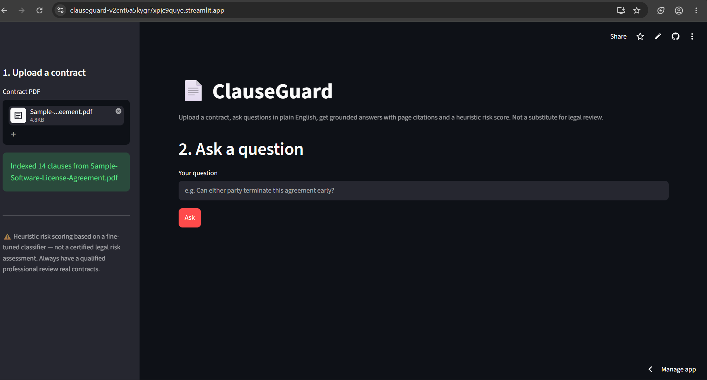
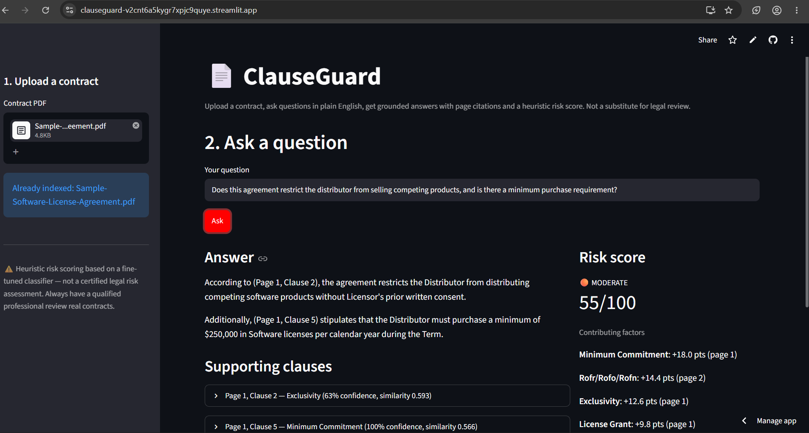
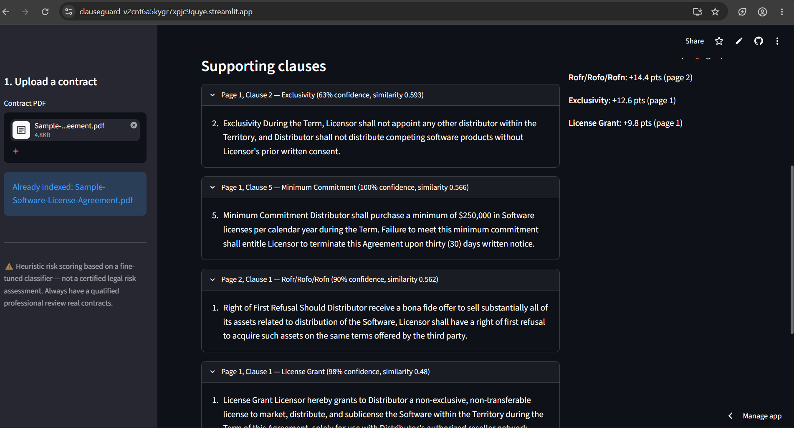

# ClauseGuard 📄
> Contract-intelligence platform combining LoRA-fine-tuned clause classification, citation-grounded RAG, and automated hallucination evaluation


---

## 🌐 Live Demo

| Service | URL |
|---|---|
| Dashboard | [clauseguard-v2cnt6a5kygr7xpjc9quye.streamlit.app](https://clauseguard-v2cnt6a5kygr7xpjc9quye.streamlit.app/) |

> ⚠️ Runs on Streamlit Community Cloud's free tier — first request after inactivity may take a few seconds to wake up.

---

## 🎯 Model Performance

Fine-tuned on clauses extracted from [CUAD](https://www.atticusprojectai.org/cuad) (Contract Understanding Atticus Dataset) — 500+ real, expert-annotated commercial contracts.

| Metric | Score |
|---|---|
| Classifier Accuracy | **89.0%** |
| Classifier Macro-F1 | **88.2%** |
| Risk Categories | **15** CUAD categories + NONE |
| Training Examples | **6,507** clause-level samples |
| Correct-Decline Rate (baseline prompt) | 41.7% |
| Correct-Decline Rate (citation-or-decline prompt) | **58.3%** (+40% relative) |

---

## 🏗️ System Architecture

```
                    Contract PDF
                         │
                         ▼
          ┌──────────────────────────┐
          │  PDF Parser + Chunker    │
          │  (page + clause number)  │
          └────────────┬─────────────┘
                        │
                        ▼
          ┌──────────────────────────┐
          │  LoRA-Fine-Tuned RoBERTa │
          │  Risk Classifier         │
          │  Acc: 89.0% / F1: 88.2%  │
          └────────────┬─────────────┘
                        │
                        ▼
          ┌──────────────────────────┐
          │  ChromaDB Vector Store   │
          │  Semantic Retrieval      │
          └────────────┬─────────────┘
                        │
                        ▼
          ┌──────────────────────────┐
          │  RAG Agent               │
          │  Groq LLaMA 3.1          │
          │  Citation-or-Decline     │
          └────────────┬─────────────┘
                        │
                        ▼
          ┌──────────────────────────┐
          │  Risk Scoring Engine     │
          │  Heuristic, Weighted     │
          └────────────┬─────────────┘
                        │
                        ▼
          ┌──────────────────────────┐
          │  Streamlit Dashboard     │
          │  Answer + Citations +    │
          │  Risk Breakdown          │
          └──────────────────────────┘
```

Independently evaluated by an **NLI-based harness** (`MoritzLaurer/DeBERTa-v3-base-mnli-fever-anli`) — a separate model scoring whether each answer sentence is actually entailed by the retrieved clause, not the same LLM grading its own output.

---

## ✨ Features

### 🧠 Fine-Tuned Risk Classification
- **LoRA-fine-tuned RoBERTa** classifier trained on real CUAD contract clauses
- 15 risk categories: Cap on Liability, Exclusivity, IP Ownership, Audit Rights, and more
- 89.0% accuracy / 88.2% macro-F1 on held-out validation data

### 🔍 Citation-Grounded RAG
- Semantic retrieval via ChromaDB + sentence-transformer embeddings
- Every answer cites the **verified page and clause number** (parsed during chunking, never guessed by the LLM)
- Strict system prompt forces the model to decline rather than hallucinate when the contract doesn't address a question

### 📊 Heuristic Risk Scoring
- 0–100 risk score computed from classified clause categories
- Full contributor breakdown showing exactly which clauses drove the score
- Explicit "not a legal risk certification" disclaimer — heuristic, not legal advice

### 🧪 Automated Evaluation Harness
- 36-question test set (answerable + deliberately unanswerable)
- NLI-based faithfulness scoring — independent of the generating LLM
- Before/after comparison quantifying the effect of the citation-or-decline prompt constraint

---

## 📸 Screenshots

### Dashboard — Upload & Ask


### Answer with Citations & Risk Score


### Supporting Clauses (Expandable)


---

## 🛠️ Tech Stack

| Layer | Technology | Purpose |
|---|---|---|
| Fine-Tuning | PyTorch, Hugging Face Transformers, PEFT (LoRA) | Clause risk classification |
| Retrieval | ChromaDB, sentence-transformers | Semantic clause search |
| LLM | Groq (Llama 3.1) | Grounded answer generation |
| Evaluation | NLI cross-model (DeBERTa-v3) | Independent hallucination/faithfulness scoring |
| Dashboard | Streamlit | User-facing app |
| Data | CUAD (Contract Understanding Atticus Dataset) | Training + evaluation source |

---

## 🚀 Running Locally

### Prerequisites
- Python 3.10+
- [Groq API key](https://console.groq.com/keys) (free)
- (Optional, for re-training) Google Colab free GPU tier

### 1 · Clone the repo
```bash
git clone https://github.com/sindhusali/clauseguard.git
cd clauseguard
```

### 2 · Environment setup
```bash
python -m venv venv
venv\Scripts\activate        # Windows
# source venv/bin/activate   # Mac/Linux
pip install -r requirements.txt
```

### 3 · Configure your API key
Create a `.env` file in the project root:
```env
GROQ_API_KEY=your_groq_api_key
```

### 4 · Run the dashboard
```bash
cd src
streamlit run dashboard_app.py
# App running on http://localhost:8501
```

### 5 · (Optional) Re-train the classifier
Training needs a GPU — run in Google Colab:
```bash
python data_prep.py
python train_lora_classifier.py
```

### 6 · (Optional) Re-run the evaluation harness
```bash
python eval_harness.py
```

---

## 📁 Project Structure

```
clauseguard/
├── data/                       # CUAD-derived training dataset
├── models/                     # trained LoRA adapter
├── chroma_store/               # vector database (gitignored, regenerable)
├── sample_contracts/           # test PDFs
├── screenshots/                # dashboard screenshots
│
└── src/
    ├── data_prep.py             # CUAD → clause classification dataset
    ├── train_lora_classifier.py # LoRA fine-tuning
    ├── classifier_inference.py  # loads trained adapter for inference
    ├── pdf_chunking.py          # PDF → clause chunks (page + clause number)
    ├── vectorstore_setup.py     # ChromaDB indexing
    ├── rag_agent.py             # retrieval + classification + grounded answer
    ├── nli_checker.py           # NLI-based faithfulness scoring
    ├── eval_harness.py          # automated hallucination-rate evaluation
    ├── risk_scoring.py          # heuristic risk score engine
    ├── report_generator.py      # explainability report (CLI)
    └── dashboard_app.py         # Streamlit dashboard
```

---

## 🧠 How the Citation-or-Decline Pipeline Works

```
User asks a question
        ↓
ChromaDB retrieves top-5 semantically relevant clauses
        ↓
LoRA classifier tags each clause with a risk category
        ↓
Groq LLaMA 3.1 answers using ONLY the retrieved clauses
Every claim must cite (Page X, Clause Y) — verified metadata,
never a guessed number
        ↓
If the clauses don't support an answer, the model must say so
explicitly instead of fabricating a response
        ↓
Risk Scoring Engine computes a 0–100 score from the
classified categories present
        ↓
Dashboard displays: answer, citations, supporting clauses,
and full risk breakdown
```

---

## ⚠️ Known Limitations

- **Risk scoring is heuristic, not legal advice** — weights reflect general contract-risk intuition, not a certified legal model. Displayed as a disclaimer in the dashboard itself.
- **Classifier covers 15 of CUAD's 41 categories** (the most frequent, to keep per-class training data sufficient). Rarer clause types classify as NONE even when present.
- **Evaluation set is 36 questions** across NDA and commercial-license contract types — a larger, more diverse set would tighten the hallucination-rate estimate.
- **Clause-number extraction is regex-based**, reliable on standard numbered formats; unusually formatted contracts fall back to page-only citation.

## 🔮 What's Next

- Contradiction detection between clauses using the existing NLI infrastructure
- Multi-agent orchestration (LangGraph) separating retrieval, compliance flagging, and reporting into inspectable steps
- Expanded evaluation set across more contract types

---

## 👩‍💻 Author

**Sali Sindhu Sri**

[](https://linkedin.com/in/sindhu-sri-sali-6867463b2/)
[](https://github.com/sindhusali)
[](https://sindhusali.github.io/sindhusrisali.github.io/)

---

## 📄 License

MIT License — feel free to use this project as a reference or template.
